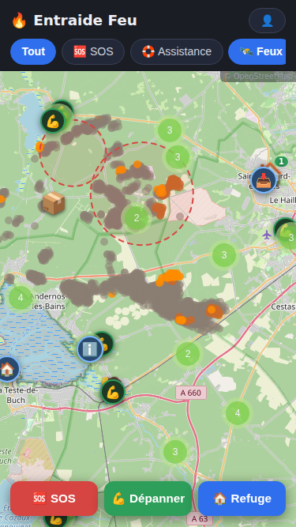
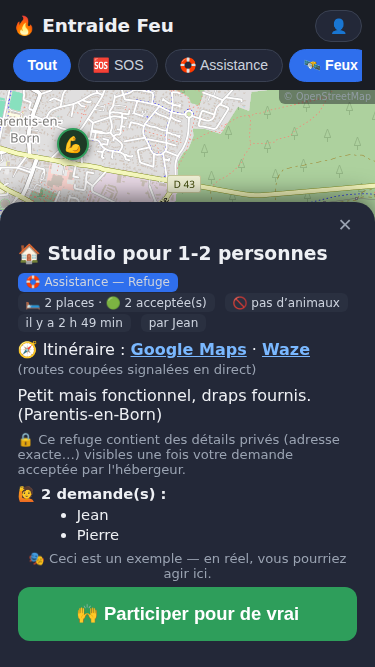

# 🔥 Entraide Feu

> **EN** — Emergency mutual-aid map built during the July 2026 Gironde wildfires
> (France): residents and responders post geolocated **SOS** (hands/vehicle,
> supplies, medical) and **shelters/collection points** on a live map. No
> accounts — an anonymous cookie plus a one-time session code. Everything
> expires in 24h. Email alerts by category & radius, NASA FIRMS fire layer,
> consent-based phone exchange, demo mode. One Node process + MySQL: built to
> be **forked for any territory or any emergency** — see [FORKING.md](FORKING.md).

 

Carte d'entraide d'urgence en zone d'incendie : les habitants et les forces opérationnelles émettent
des **besoins** (bras/véhicule, matériel, médical) et des **offres** (points de collecte, refuges),
géolocalisés sur une carte publique. Sans compte, sans friction — un cookie technique anonyme suffit.

**Principes :**
- Une fiche = un titre, un message public, une partie privée optionnelle (visible uniquement des
  personnes qui déclarent venir), une photo (EXIF nettoyés), un vocal (≤ 60 s).
- Bouton **« J'arrive »** (avec ETA et compteur), échange de numéro **consenti** de pair à pair,
  clôture par l'émetteur (cookie ou code de secours).
- **Tout expire en 24 h** — re-déclarer chaque jour fait partie du jeu : le feu bouge, la carte
  doit refléter le terrain du jour. Suppression définitive (fichiers compris) sous 72 h.
- Mode **vigie** : notifications push par catégories + rayon ; option « sur le qui-vive » qui
  affiche un halo flouté (~500 m) rassurant sur la carte.
- Modération : bouton signaler (masquage à 3 signalements), page admin (suppression, bannissement,
  zones de danger affichées sur la carte).
- **Couche feux satellites** : anomalies thermiques NASA (GIBS/VIIRS/MODIS, sans clé d'API),
  servie par un proxy local avec cache qui sélectionne la dernière date réellement publiée.
- **Points officiels** (🏛️ hébergements, collectes préfectorales) : synchronisés automatiquement
  depuis alertesfeux.fr toutes les 6 h (+ saisie manuelle admin), sans expiration, hors clustering.
- **Position des dépanneurs** : partagée uniquement au « j'arrive », visible du seul émetteur,
  rafraîchissable en route (🚗 sur la carte de l'émetteur).

Architecture détaillée et invariants de sécurité : voir [ARCHITECTURE.md](ARCHITECTURE.md).

⚠️ Cet outil ne se substitue pas aux secours. Urgence vitale : **18 / 112**.

## Stack

Node.js (Express) · MariaDB/MySQL · Leaflet + OpenStreetMap · Web Push (VAPID, auto-hébergé) ·
PWA (service worker, hors-ligne, notifications). Aucun service externe, aucune clé d'API tierce.

## Installation

```bash
git clone <ce repo> && cd entraide-feu
npm install
cp .env.example .env    # renseigner la base de données (socket UNIX ou hôte), BASE_URL, CONTACT_EMAIL
npm start
```

Au premier démarrage : le schéma SQL est créé automatiquement, les clés (secret cookie, clé admin,
clés VAPID) sont générées dans `data/` si absentes de `.env`. L'URL d'admin est affichée dans la console.

### Base de données

Créer une base et un utilisateur (ex. via phpMyAdmin sur un mutualisé), puis renseigner `.env` :

```
DB_SOCKET=/var/run/mysqld/mysqld.sock   # ou DB_HOST/DB_PORT en TCP
DB_NAME=firemap
DB_USER=firemap
DB_PASS=...
```

Le pool est limité à 5 connexions (adapté aux hébergements mutualisés).

### HTTPS local (test mobile sur le LAN)

La géolocalisation et le push exigent HTTPS. Pour tester depuis un téléphone du
réseau local : `mkcert -key-file certs/dev-key.pem -cert-file certs/dev-cert.pem
<IP_LAN> localhost`, renseigner `HTTPS_KEY`/`HTTPS_CERT` dans `.env` (HTTPS servi EN PLUS du HTTP, port `HTTPS_PORT`, défaut 3443), puis
installer la CA mkcert (`rootCA.pem`) sur le téléphone (Android : Paramètres →
Sécurité → Installer un certificat → CA). Retirer les 2 variables = retour HTTP.

### Production

- **HTTPS obligatoire** (géolocalisation et push l'exigent) : un reverse proxy Caddy ou nginx +
  Let's Encrypt devant le port Node (`PORT`, défaut 3000).
- Garder le process en vie : `pm2 start server.js --name entraide-feu` ou une unité systemd.
- `BASE_URL=https://votre-sous-domaine.fr` (sert aux liens de partage et au QR).
- Sauvegarde : la base expire d'elle-même en 24-72 h ; un dump quotidien suffit largement.
- Purge des données de test : `npm run purge` (fiches + uploads), `npm run purge:all`
  (+ identités et vigies), `npm run purge:full` (+ points officiels et zones).

### Pages

- `/` — la carte et toute l'application
- `/admin.html` — modération (clé affichée au démarrage, ou `data/admin_key.txt`)
- `/affiche.html` — affiche imprimable avec QR code
- `/legal.html` — mentions légales et RGPD
- `/p/<id>` — lien de partage d'une fiche (aperçu OpenGraph)

## Forker

Ce projet est sous licence MIT : **forkez-le**, déployez votre instance pour votre territoire,
adaptez les textes. Il a été conçu pour qu'une seule personne puisse l'opérer : un process Node,
une base MySQL, un dossier d'uploads — rien d'autre.

## Sécurité & vie privée (résumé)

- Identité = cookie HttpOnly anonyme ; la base ne stocke que des empreintes HMAC.
- Numéros de téléphone jamais publics, transmis uniquement au destinataire choisi, purgés avec la fiche.
- Photos recompressées côté client (EXIF/GPS supprimés), uploads plafonnés à 1,5 Mo.
- Rate limiting par IP (généreux, compatible CGNAT), professions déclarées « sur l'honneur »
  et affichées comme telles.
